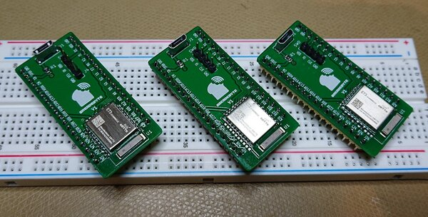

Breadebyte
==========

Breadebyte is a breakout board for EBYTE E73-2G4M08S1E module containing
Nordic nRF52833 SoC.

This uses a [shared symbol/footprint
library](https://github.com/spbnick/kicad-lib).
